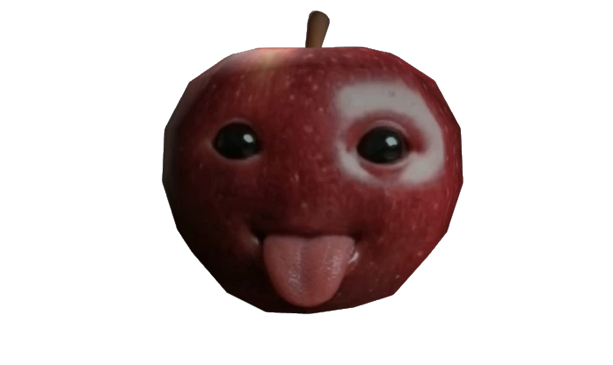

<link rel="shortcut icon" type="image/png" href="appleT2.png">



Hi, I do Java 😱:
```
//Some Simple Java
public class HelloWorld {
      public static void main(String[] args) {
        final String HELLO = "Hello World!";
        hello(HELLO);
    }
static String hello(String Hello) {
    return Hello;
  }
}
```
\
\
Alr, heres something for fun 😡:

```
import javax.swing.JOptionPane;

public class Main {
    public static void main(String[] args) {
        fun();
    }
  static void fun(){
    String Letter = JOptionPane.showInputDialog(null, "Type the following letter \'L\'");
    
    System.out.println(Letter);
        
    if (Letter.equalsIgnoreCase("L")) {
      
      JOptionPane.showConfirmDialog(null, "Yes", "Click \'Yes\'", JOptionPane.WARNING_MESSAGE);

      while (true) {
        JOptionPane.showMessageDialog(null, "YOUR COMPUTOR HAS A VIRUS!", "VIRUS DETECTED", JOptionPane.ERROR_MESSAGE);
        
      }
      
      } else {
      JOptionPane.showMessageDialog(null, "You think your funny");
      fun();
      }
    }
  }
```
# You wanna check out my [Github?](https://github.com/NicheFruit)
