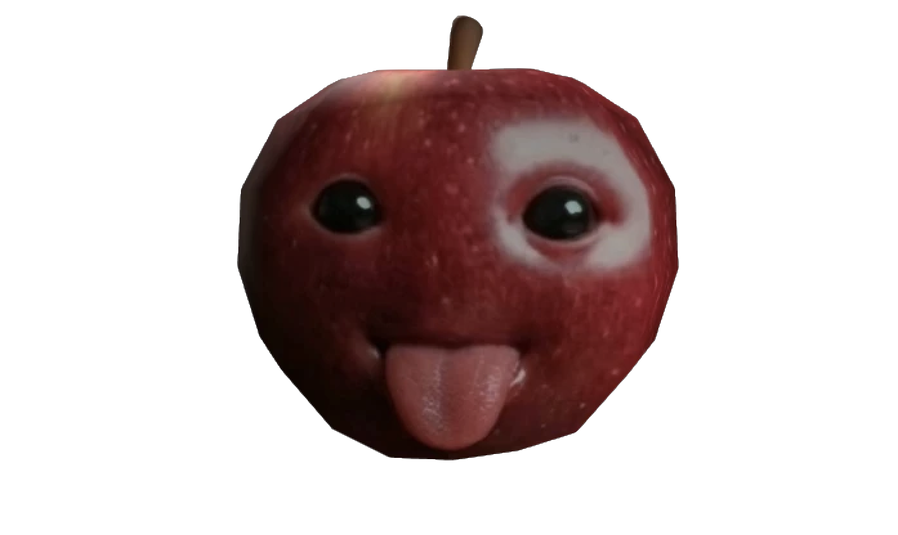

<link rel="shortcut icon" type="image/png" href="appleT2.png">

<h1 align="center">NicheFruit</h1>

<p align="center">
  
</p>

<p align="center">
  
  
  
  
</p>

---

## 🗞️ About Me

I have a strong appreciation for creativity, abstract thinking, and unconventional ideas. My interests often blend imagination with technical exploration, resulting in unique perspectives on both everyday experiences and complex systems.

I enjoy experimenting with concepts that challenge traditional logic while maintaining a structured and thoughtful approach to problem-solving.

Additionally, I am fascinated by how seemingly unrelated elements—whether in technology, culture, or storytelling—can intersect in unexpected and meaningful ways. This curiosity drives both my creative expression and my technical work.

---

## 💻 Programming & Development

<p align="center">
  
</p>

- Primary Language: **Java** ☕  
- Interests: Shi, I'll do anything.  
- Focus: Mostly clean, scalable, object-oriented applications

🔗 GitHub: [https://github.com/NicheFruit](https://github.com/NicheFruit)

---

## Java Example

```java
// (same code as before)
```

---

## 📂 Downloads & Resources

<p align="center">
  <a href="https://sourceforge.net/u/nichefruit/profile/">
    
  </a>
  <a href="#">
    
  </a>
  <a href="#">
    
  </a>
  <a href="#">
    
  </a>
  <a href="https://forms.gle/DVhy9jQ45dG45J7z7">
    
  </a>
</p>

---

<p align="center">
  Thanks for visiting!
</p>
