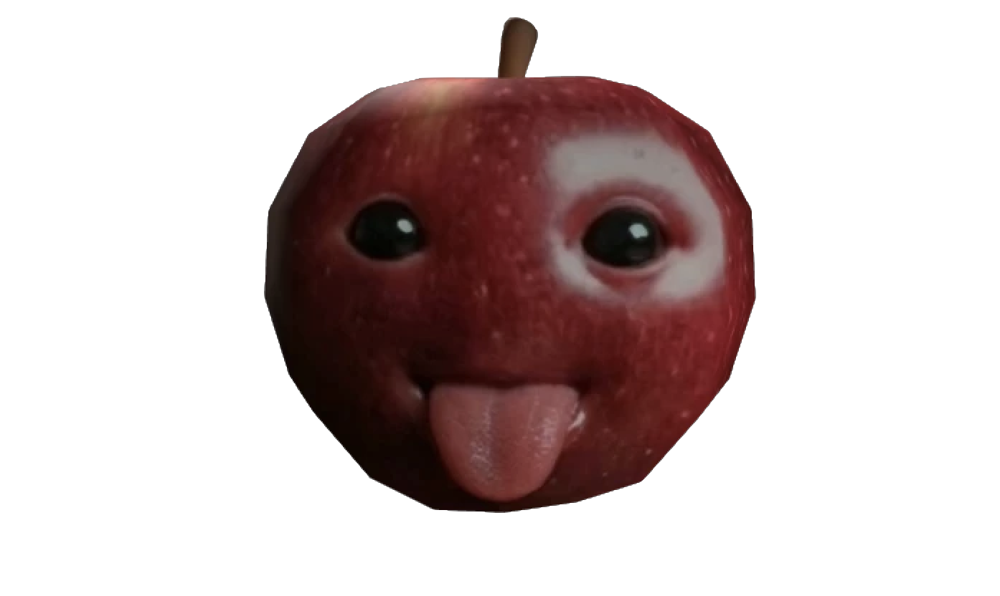

<link rel="shortcut icon" type="image/png" href="appleT2.png">

<h1 align="center">NicheFruit</h1>

  

  
  
  
  
  

---

## About Me

I enjoy experimenting with concepts that challenge normal logic while staying organized and thoughtful. I’m always curious about how systems work, whether in code, design, or storytelling, and I enjoy breaking problems into pieces to find clever solutions.

This curiosity inspires both my creative projects and my technical work, driving me to experiment, learn, and create things that are both functional and imaginative.
When I’m not programming or building projects, I enjoy exploring new ideas, testing unconventional approaches, and pushing boundaries to see what’s possible. I like projects that mix logic and creativity, and I find satisfaction in turning abstract concepts into something tangible and useful.

---

## 💻 Programming & Development

  

- Primary Language: **Java** ☕  
- Interests: Shi, I'll do anything.  
- Focus: Mostly clean, scalable, object-oriented applications

🔗 GitHub: [https://github.com/NicheFruit](https://github.com/NicheFruit)
 
💾 Itch IO: [https://nichefruit.Itch.io](https://nichefruit.itch.io)

---

## 📂 Downloads & Resources

  
  
  
  

---

